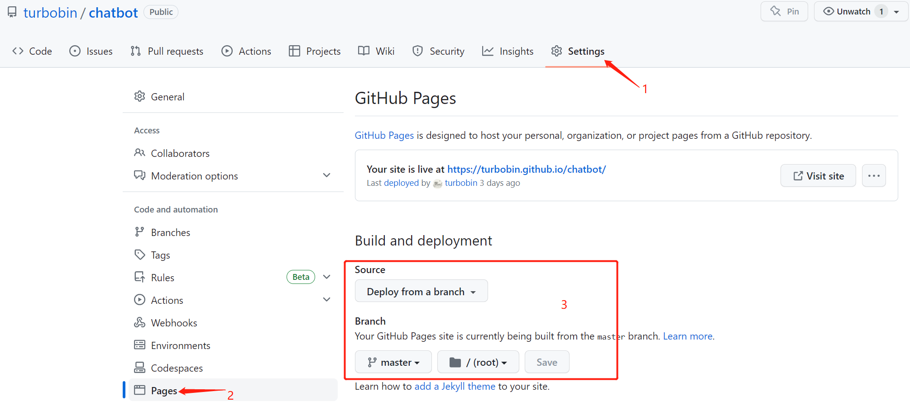
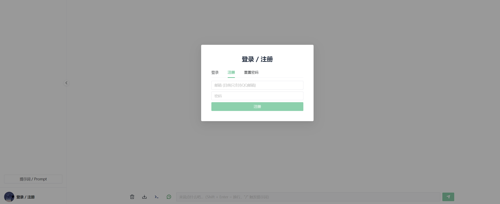
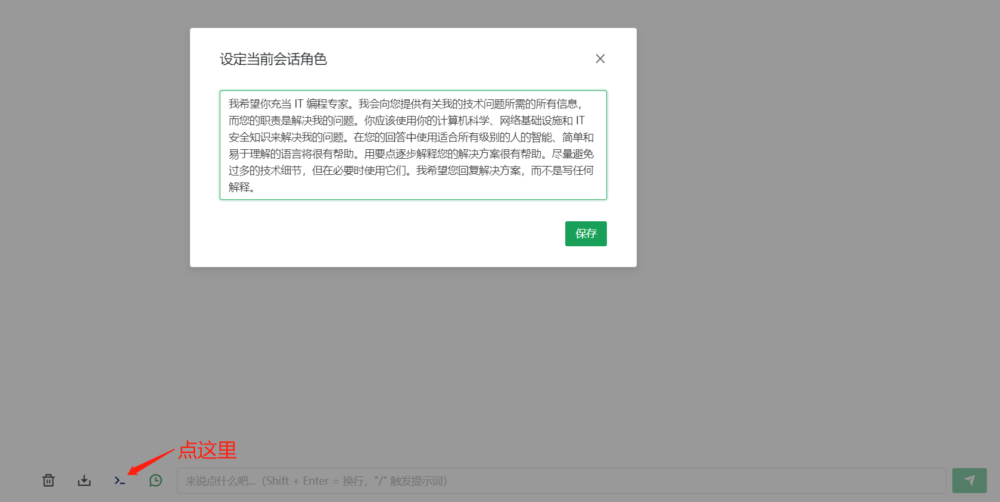
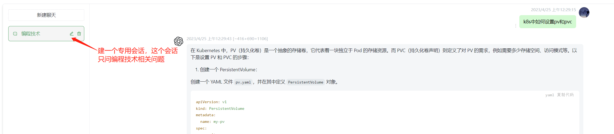
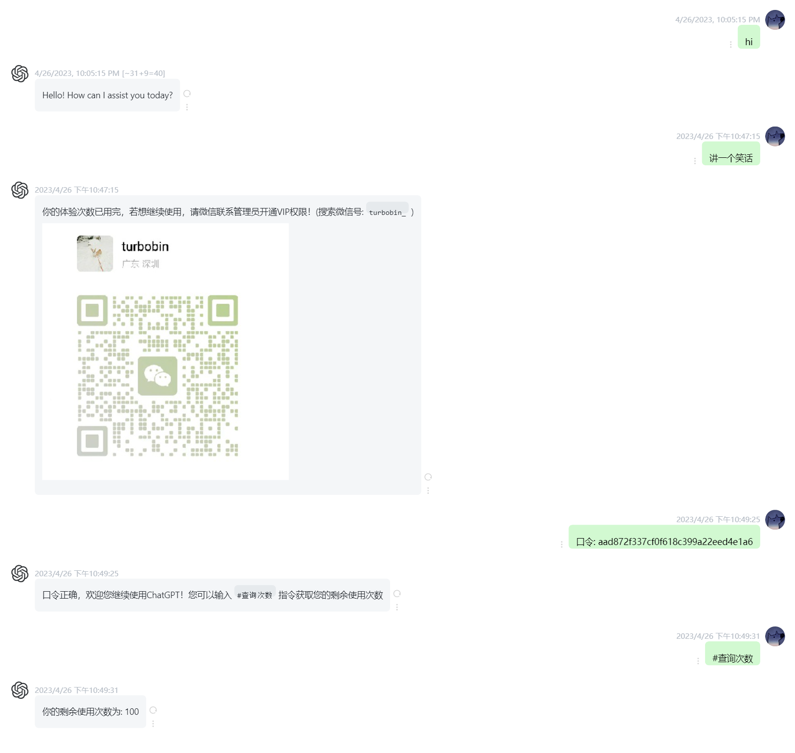

# ChatGPT Web

在线体验：[https://turbobin.github.io/chatbot](https://turbobin.github.io/chatbot)

## 说明

> **此项目 Fork 自 [Kerwin1202/chatgpt-web](https://github.com/Kerwin1202/chatgpt-web), 原始项目为 [Chanzhaoyu/chatgpt-web](https://github.com/Chanzhaoyu/chatgpt-web)，此项目在前面的基础上增加了一些定制功能:**

[✓] 用户注册&登录&重置密码

[✓] admin用户设置，用户VIP权限控制

[✓] 历史会话保存，导出

[✓] 自定义敏感词

[✓] 每个会话独有角色设置

[✓]  More...

此项目使用 github 托管前端，后端部署在腾讯云服务器，域名使用 `<you-username>.github.io`，没错，就是 GitHub Page 功能！此种方式不需要去购买域名，因此也不必花费大量精力去搞域名备案，国内国外都可流畅访问（github 域名应该...不太容易 ban 吧...hhh）

如果你想拥有一个自己专属域名访问 ChatGPT，操作非常简单：

1. fork 此项目
2. 设置一下 Github Page

## 界面

权限控制，用户可获取管理员生成的口令增加次数：

## 交流

项目功能还在持续迭代开发，如果你对此项目感兴趣，或者需要技术咨询，可微信联系我 `turbobin_`，来源请注明`github`。

## License

MIT © [turbobin](./license)